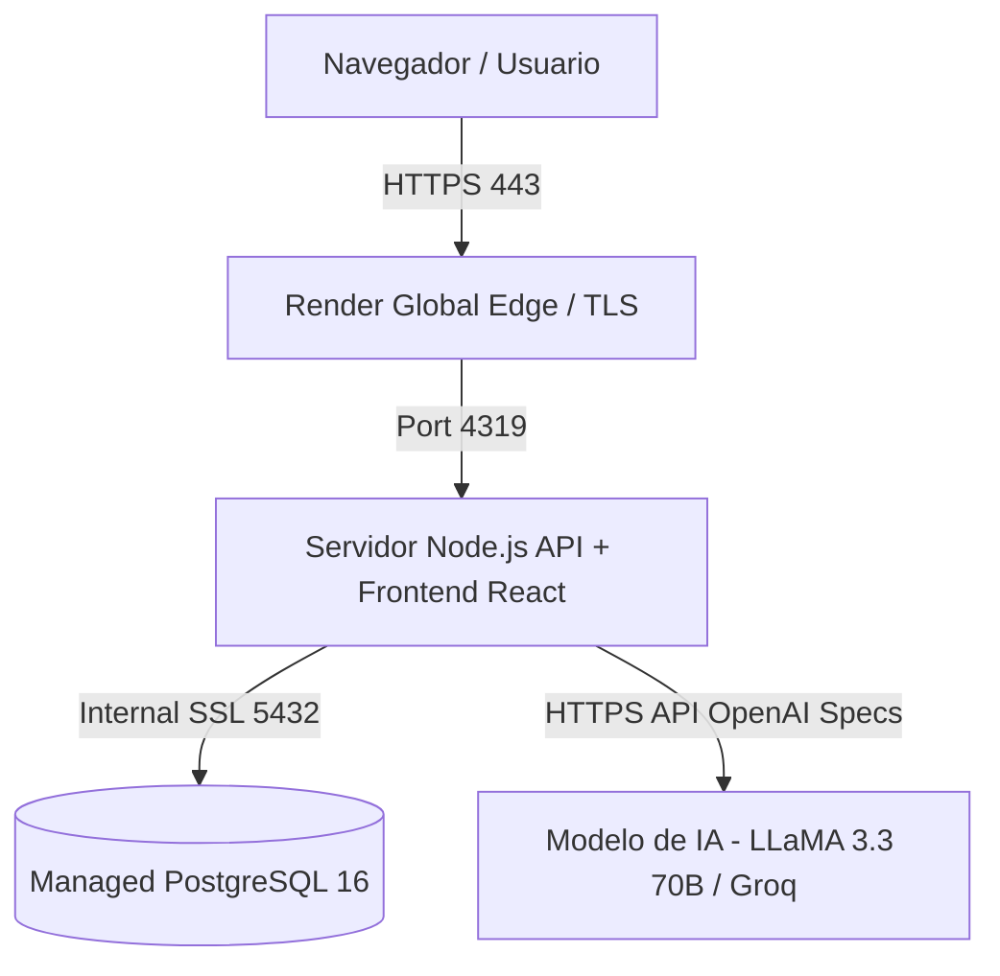

# Guía de Despliegue y Documentación Técnica — Agent Deployment Challenge

Este documento detalla la arquitectura del sistema, las decisiones técnicas justificadas y los pasos completos para desplegar y probar la aplicación **Agent Console** tanto en **Render** como en un contenedor **Docker / VPS**.

---

## Arquitectura del Sistema



### Componentes Clave:
1. **Frontend (`apps/web`)**: SPA en React 19 + Vite. Se sirve compilada como activos estáticos desde el servidor Express en producción.
2. **Backend (`apps/api`)**: Servidor Express 5 en Node.js 22 (ESM). Gestiona la salud de la app (`/api/health`), autenticación (`/api/auth`), conversaciones y chat con el modelo.
3. **Persistencia & Memoria (`PostgreSQL 16`)**: Almacena usuarios, hashes de contraseñas (`scrypt`), tokens de sesión, conversaciones y mensajes. Soporta memoria cruzada e indexación para relacionar conversaciones.
4. **Auto-Migraciones (`runner.mjs`)**: Ejecución asíncrona de scripts DDL al conectar la base de datos para garantizar que las tablas `users`, `sessions`, `conversations` y `messages` estén siempre listas.

---

## Decisiones Técnicas y Justificaciones

| Área / Decisión | Elección Técnica | Justificación Principal |
| :--- | :--- | :--- |
| **Plataforma de Despliegue** | Render (PaaS) con Web Service + Managed Postgres 16 | He elegido Render principalmente por la rapidez y facilidad de uso que ofrece en su capa gratuita. Me permite tener la API de Node.js y la base de datos PostgreSQL 16 conectadas en la nube en pocos minutos, con HTTPS automático y despliegue continuo desde GitHub cada vez que hago un push. |
| **Contenerización** | Docker Multi-Stage Build (`Dockerfile`) | He utilizado una compilación en dos etapas (Multi-Stage Build) en Docker para separar el entorno de construcción del entorno de producción. En la primera etapa uso todas las herramientas pesadas para compilar el código de React, y en la segunda etapa descarto esas herramientas y me quedo solo con los archivos compilados en una imagen muy pequeña basada en Alpine. Esto hace que el contenedor pese poquísimo (~100 MB), se despliegue en segundos y sea mucho más seguro y eficiente. |
| **Base de Datos** | PostgreSQL 16 | He utilizado PostgreSQL 16 porque combina lo mejor de dos mundos: por un lado, la seguridad de una base de datos relacional para gestionar logins y sesiones sin riesgo de pérdida de datos; y por otro, una gran flexibilidad para realizar búsquedas eficientes en el historial de mensajes de texto. Esto me permite consultar de forma rápida todas las conversaciones pasadas de un mismo usuario y alimentar la memoria cruzada de la IA de forma totalmente fluida. |
| **Seguridad / Auth** | Hashing `scrypt` (`crypto.scryptSync`) + Tokens de Sesión | He usado la criptografía nativa de Node.js para el sistema de login y autenticación. El motivo principal fue para evitar problemas de compatibilidad. |
| **Modelo de IA** | API compatible con ChatCompletions (`LLaMA 3.3 70B Versatile via Groq`) | He escogido el estándar OpenAPI de la industria con respuesta rápida en milisegundos. Permite cambiar de proveedor solo cambiando variables en `.env`. |
| **Memoria Cruzada** | Inyección Dinámica del Historial de Usuario | He elegido implementar la memoria persistente directamente en el servidor. Cuando el usuario autenticado envía un mensaje, el servidor recupera sus mensajes pasados guardados en PostgreSQL y los adjunta al prompt del modelo como historial de memoria. |

---

## Despliegue en Render (En Vivo en Producción)

### Entorno Desplegado:
- **URL Pública Web**: `https://agent-deployment-challenge-rm27.onrender.com`
- **Repositorio GitHub**: `https://github.com/ernesto2604/agent-deployment-challenge`

### Pasos de Despliegue Realizados:
1. **Creación del PostgreSQL Service**:
   - Tipo: PostgreSQL 16 (Free Plan).
   - Base de Datos: `agent_db_2xyw`.
2. **Creación del Web Service**:
   - Entorno: Docker (`Dockerfile`).
   - Comando de Inicio: `npm start`.
   - Variables de Entorno en Render:
     - `PORT`: `4319`
     - `DATABASE_URL`: `postgresql://<user>:<password>@<internal-host>/<db>`
     - `MODEL_API_BASE_URL`: `https://api.groq.com/openai/v1`
     - `MODEL_API_KEY`: `<API_KEY>`
     - `MODEL_NAME`: `llama-3.3-70b-versatile`
     - `MODEL_SYSTEM_PROMPT`: `Eres un asistente virtual atento e inteligente con memoria entre conversaciones...`

---

## Despliegue Alternativo con Docker Compose (Local / VPS)

Si se prefiere ejecutar la aplicación en una máquina local o servidor VPS:

```bash
# 1. Clonar el repositorio
git clone https://github.com/ernesto2604/agent-deployment-challenge.git
cd agent-deployment-challenge

# 2. Configurar variables de entorno (.env)
cp .env.example .env

# 3. Iniciar los contenedores con Docker Compose
docker compose up -d --build
```